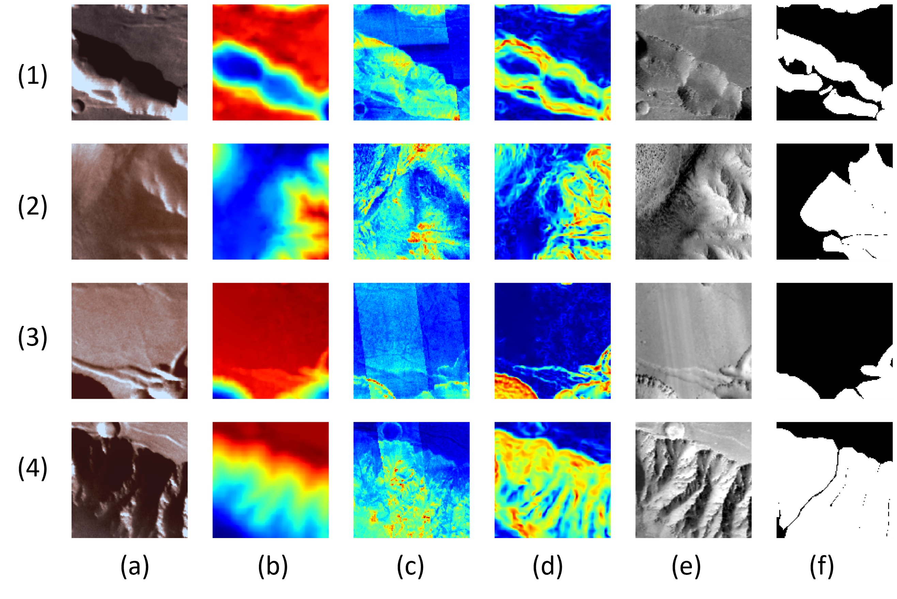

# MarsLS-Net: Martian Landslides Segmentation Network and Benchmark Dataset
[](https://opensource.org/licenses/MIT)

Martian landslide segmentation is a challenging task compared to the same task on Earth. One of the reasons is that vegetation is typically lost or significantly less compared to its surroundings in the regions of landslide on Earth. In contrast, Mars is a desert planet, and there is no vegetation to aid landslide detection and segmentation. Recent work has demonstrated the strength of vision transformer (ViT) based deep learning models for various computer vision tasks. Inspired by the multi-head attention mechanism in ViT, which can model the global long range spatial correlation between local regions in the input image, we hypothesize self-attention mechanism can effectively capture pertinent contextual information for the Martian landslide segmentation task. Furthermore, considering parameter efficiency or model size is another important factor for deep learning algorithms, we construct a new feature representation block, namely Progressively Expanded Neuron Attention (PEN-Attention), to extract more relevant features with significantly fewer trainable parameters. Overall, we refer to our deep learning architecture as the Martian landslide segmentation network (MarsLS-Net). 


<p align="center">
  
</p>

Figure 1. Location of Valles Marineris (VM) on Mars used for landslide segmentation in this study. The elevation map of VM draped over hillshade.


## Model


Figure 2. The proposed MarsLS-Net architecture. (a) the overall framework of MarsLS-Net model that is composed of a series of stacked PEN attention blocks, (b) represents the illustration of the multi-head self-attention mechanism, (c) provides details of the ConvPE Layer, and (d) illustrates the structure of the PEN attention block.


## Dataset Samples



Figure 3. Sample of landslides regions (128 × 128) in the MMLS dataset with their respective segmentation mask and modalities:
(a) RGB, (b) DEM, (c) thermal inertia, (d) slope, (e) gray-scale, and (f) ground truth.


Figure 4. Distribution of Martian landslides in the Valles Marineris region. Region (b) and (d) are used to train and validate deep learning models respectively, while region (c) is used for performance testing.


## Citation

If you use [MarsLS dataset](https://github.com/MAIN-Lab/Multimodal-Martian-Landslides-Dataset) in your research, we would appreciate a citation to the original paper:

Paheding, S., Reyes, A. A., Rajaneesh, A., Sajinkumar, K. S., & Oommen, T. (2024, January). MarsLS-Net: Martian Landslides Segmentation Network and Benchmark
Dataset. Proceedings of the IEEE/CVF Winter Conference on Applications of Computer Vision (WACV), 2024.

```

```

